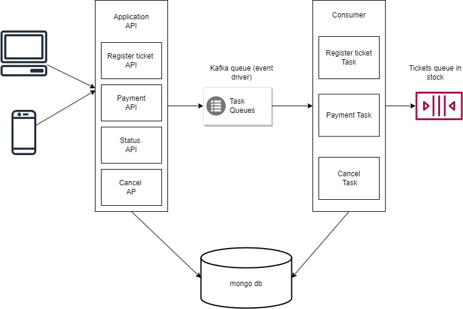
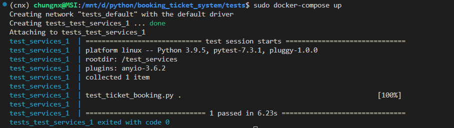

# TICKET BOOKING SYSTEM
## Overivew Architecture:




# Services available
| Endpoint | Method | Description
| --- | --- | --- |
| http://localhost:8003/register | POST | Send request book ticket and assign a ticket id if ticket 's in stock
| http://localhost:8003/status?reservation_id  | GET  | Retrieve the status of a reservation
| http://localhost:8003/payment   | POST  | Send a request to make a payment for a reservation.
| http://localhost:8003/cancel   | POST  | Cancel a reservation and release ticket id  reload to database

# RUN WITH DOCKER COMPOSE

1. Install docker. If you already have, create the container with the command:
```
sudo docker-compose up
```
2. Make sure we success built by docker-compose check with command:
```
sudo docker ps
```
You should see that 5 containers are running like:
 - ticket_booking_services_comsumer_1
 - ticket_booking_services_api_1
 - kafka
 - zookeeper
 - ticket_booking_services_mongodb_container_1

3. Open new terminal and run intergration test by command:
```
cd tests
sudo docker-compose up
```
You should see that:


You also can manually test by accessing this link : http://localhost:8003/docs
